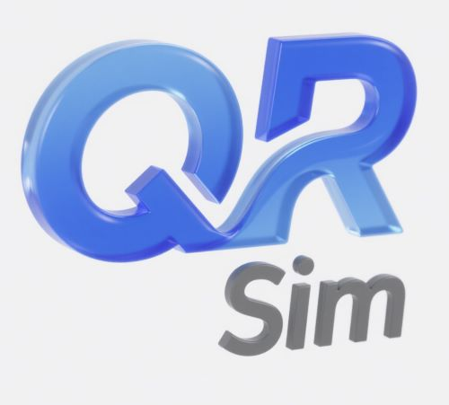
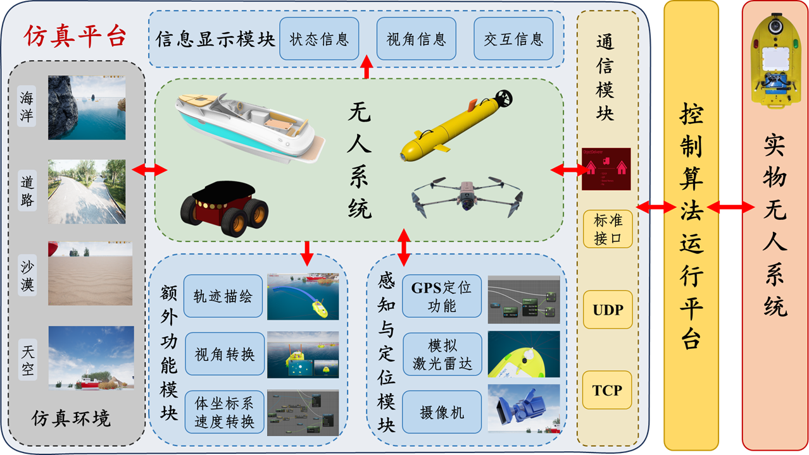

<div align='center'>
    
    <h1>QRSim</h1>
</div>

<div align="center">
  
  
  
</div>

<div align="center">
  <h3>📚 无人系统3D仿真平台</h3>
  <p><em>快速验证控制算法有效性、无缝迁移到实物平台</em></p>
</div>

---

# QRSim

QRsim(Quick Real Sim) 是一款使用虚幻引擎4开发的3D仿真平台，目前可以应用于无人系统的运动学控制3D仿真。该平台主要有两大特点，一是可以**快速(Quick)验证控制算法的有效性**，二是可以**无缝迁移到实物（Real）平台中**进行实物实验。目前该平台已经成功应用于无人艇集群的3D仿真及实物实验中，已在实验室中推广至数十人。

QRsim目前采用蓝图(BluePrint)开发，图形化编程使得开发更加容易上手、开发周期更短。

QRsim采用C/S结构，虚幻引擎平台用以针对收到的控制信息进行运动，并通过对自身和环境的感知返回给控制器新的状态信息；控制器则使用新的状态信息进行控制器的更新，并反馈给虚幻引擎平台。
这样的设计与实物中非常贴合，有利于快速移植到实物平台上。

## 工程结构
```
QRSim/
├── Config/
├── Content/
├── Controller_py/
├── QRSim.uproject
└── README.md
```

- **Config**: 虚幻引擎工程的默认配置；
- **Content**: 工程的主要内容，其中保留了初学者内容以便后续开发时有基础的物料可以使用；
- **QRSim.uproject**: 工程的核心配置文件，记录了项目的基本信息和设置。

更多项目结构可参考虚幻引擎官网：[目录结构](https://dev.epicgames.com/documentation/zh-cn/unreal-engine/directory-structure?application_version=4.27)

- **Controller_py**: 使用python语言实现的控制器算法，用以和虚幻引擎工程搭配使用，该部分可以使用各种编程语言实现。

## 安装和使用说明

开发版本：虚幻引擎4.27.2

GPU版本：RTX3060 （显卡过低可能导致运行卡顿，甚至运行出错）

### 安装
1. 安装虚幻引擎，并下载插件：**ObjectDeliverer**和**TCPSocket Plugin**
2. 克隆工程: `git clone https://github.com/adi-lee/QRSim.git`
3. 因本项目中采用了lfs，因此需等待lfs文件加载完毕，可使用`git lfs pull`来确定是否下载完成

### 使用说明
1. 双击打开`.uproject`文件；
2. 运行`Controller_py`文件中的`main.py`；
3. 点击虚幻引擎工程的“运行”，即可体验QRSim

## 功能
1. 键盘WSAD控制无人系统移动；（验证控制算法时，未开启该功能）
2. 键盘0~9可控制摄像机视角转换，以在不同角度观察；
3. 无人系统轨迹描绘和消除，tab键控制轨迹生成与否，`Q`按键消除现有轨迹；
4. 快速配置水面物体浮力；
5. 利用TCP与控制算法结合，测试控制算法有效性。

仿真平台包含子模块：虚拟物理环境、无人系统模型模块、系统定位模块、感知模块、通讯模块等。
设计框图如下：


部分功能演示如下：


本项目开发参考了以下教程，该教程亦可作为本项目的前置知识及参考：[参考](https://www.bilibili.com/video/BV19Y4y1e7KQ/?spm_id_from=333.1387.homepage.video_card.click&vd_source=765d56c958a80a8ea382c4e203764281)